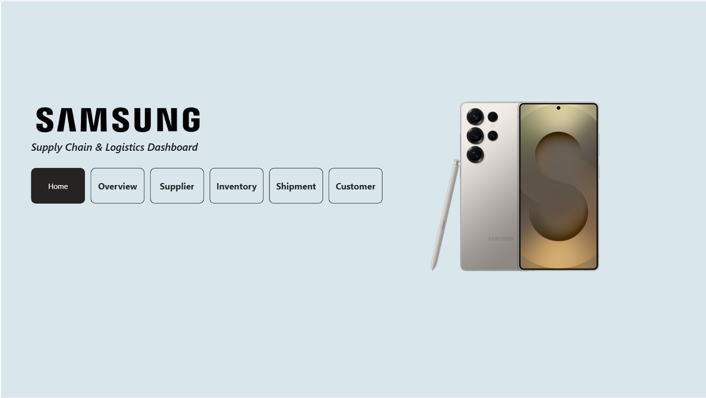
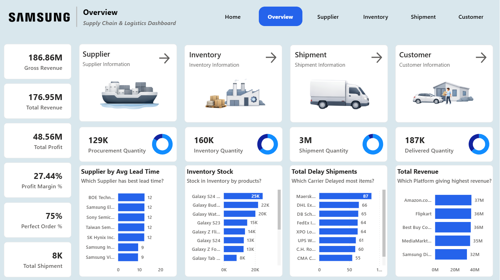
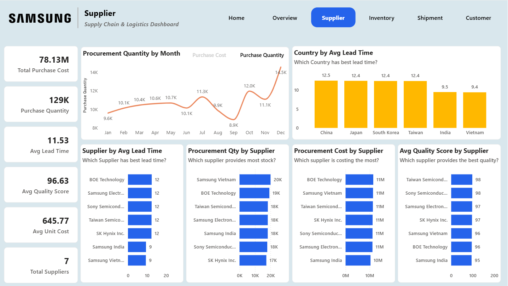
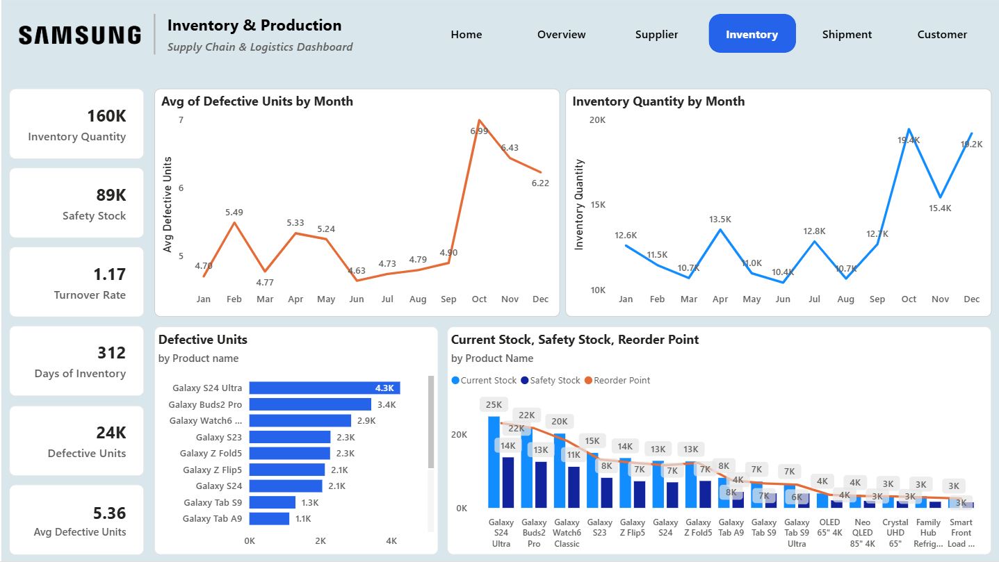
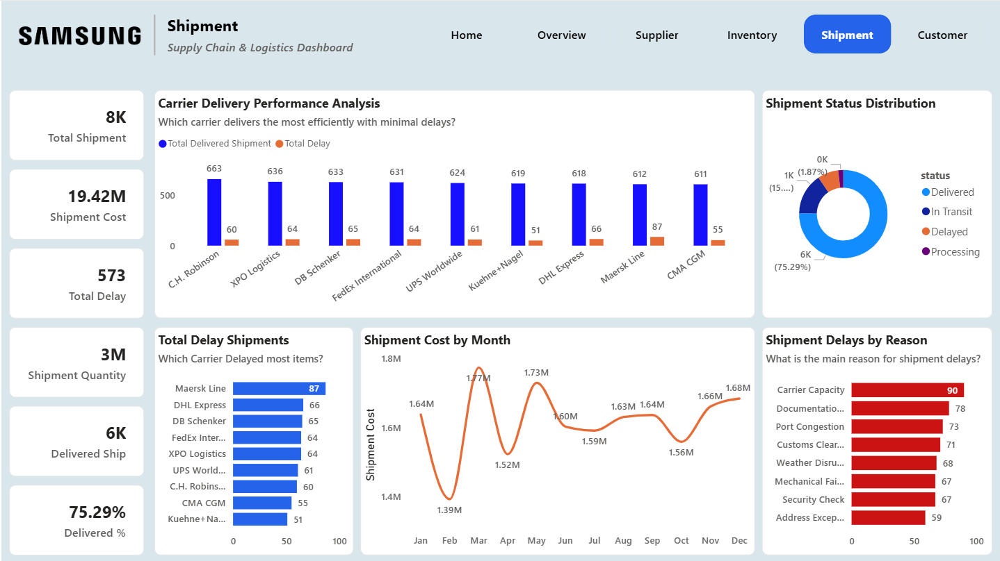
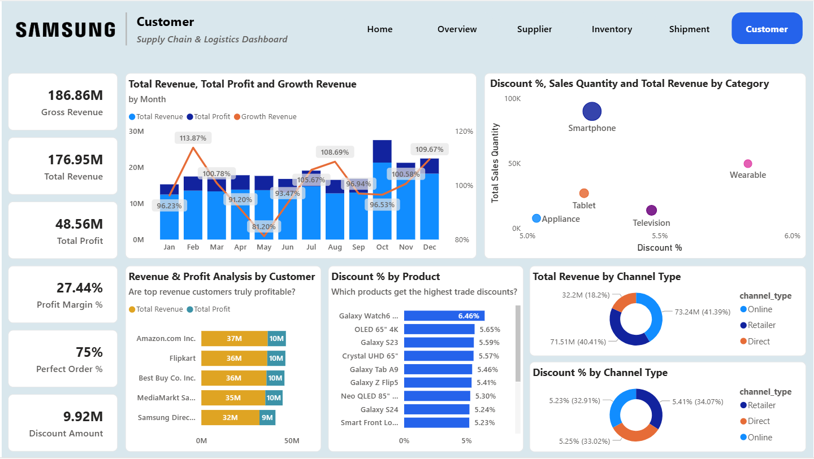

# 📦 Samsung Supply Chain & Logistics Dashboard | Power BI Analysis


---

## 📌 Project Overview

This project presents a comprehensive **Supply Chain & Logistics Dashboard for Samsung**, developed using Power BI to analyze procurement, inventory, suppliers, shipments, and overall operational performance.

The dashboard enables stakeholders to monitor key logistics KPIs, identify supply chain inefficiencies, track inventory levels, and optimize supplier and shipment performance.

Key metrics analyzed include Total Revenue, Profit Margin, Inventory Levels, Procurement Quantity, Shipment Performance, Supplier Lead Time, and Product Defect Rates.

---

## 🌐 🔗 Live Interactive Dashboard

Click below to explore the live dashboard:

👉 **[View Live Power BI Dashboard](https://app.powerbi.com/view?r=eyJrIjoiNDEyZjIxNjUtY2FiOC00NTAxLWFjMmUtMTIwMzE0ZTBmZmVmIiwidCI6ImIyZDFjYmQyLWYwMTctNDUyMC04NjA4LThkMjIyNmJlNTkyYSJ9)**

---

## 🖥️ Dashboard Preview (Public Screenshots)

---

### 🏠 Home Page | Executive Navigation Overview



The Home Page serves as the executive entry point for the Supply Chain & Logistics Dashboard, designed to provide intuitive navigation and a high-level overview of Samsung’s logistics analytics system.

Key highlights of the Home Page:

- 🧭 Interactive navigation buttons to access different dashboard modules
- 📊 Structured layout enabling quick access to:
  - Executive Overview
  - Shipment Analysis
  - Inventory Analysis
  - Supplier Performance
  - Customer & Platform Insights
- 🎯 Improves user experience and dashboard accessibility for decision-makers

This page ensures a professional dashboard experience similar to enterprise-level BI solutions used in real organizations.

---

### 📊 Executive Overview Dashboard



This dashboard provides a complete operational overview of Samsung's supply chain performance.

Key business indicators:

- 💰 Total Revenue generated across all platforms and product categories
- 📈 Gross Revenue and Profit Margin analysis for profitability tracking
- 📦 Total Inventory Quantity to monitor stock availability
- 🚚 Shipment Quantity tracking logistics throughput
- 🛒 Procurement Quantity to analyze sourcing performance
- 📅 Monthly revenue trend showing business growth patterns

Business Value:

- Enables executives to quickly evaluate overall supply chain health
- Identifies performance trends and revenue fluctuations
- Supports strategic decision-making

---

### 🤝 Supplier Performance Dashboard



This dashboard evaluates supplier efficiency and procurement performance.

Key insights:

- 🏭 Procurement quantity by supplier
- ⏱️ Supplier lead time comparison
- 📊 Supplier contribution to overall procurement
- ⚠️ Identification of slow or inefficient suppliers

Business Value:

- Helps select high-performance suppliers
- Improves procurement efficiency
- Reduces supply chain delays

---

### 📦 Inventory & Stock Management Dashboard



This dashboard focuses on inventory monitoring and stock optimization.

Key insights:

- 📦 Total inventory units available across product categories
- ⚠️ Safety stock monitoring to prevent stockouts
- 🔁 Reorder point tracking for efficient inventory replenishment
- ❌ Defective product quantity analysis

Business Value:

- Prevents overstocking and understocking
- Improves warehouse efficiency
- Supports inventory optimization decisions

---

### 🚚 Shipment & Logistics Performance Dashboard



This dashboard provides deep insights into logistics and transportation efficiency.

Key insights:

- 🚛 Shipment volume by carrier and transportation mode
- 📦 Total shipment quantity handled across logistics providers
- 📈 Shipment trends across different time periods
- ⚠️ Identification of underperforming carriers

Business Value:

- Helps optimize logistics cost and efficiency
- Identifies reliable and unreliable shipment partners
- Supports logistics optimization strategies

### 👥 Customer & Platform Performance Dashboard



This dashboard analyzes revenue performance across different platforms and customers.

Key insights:

- 💰 Revenue distribution by sales platform
- 📊 Platform-wise performance comparison
- 📈 Customer purchasing trends
- 🛒 Platform contribution to total revenue

Business Value:

- Identifies top-performing sales platforms
- Helps optimize sales channel strategy
- Supports revenue growth planning

---
---

## 📊 Key Business Insights

* 📈 Total revenue and profit trends help evaluate business performance.
* 🚚 Shipment analysis helps identify inefficient carriers.
* 📦 Inventory monitoring prevents stock shortages and overstocking.
* 🤝 Supplier lead time analysis helps improve procurement planning.
* ⚠️ Defective product tracking improves quality control.
* 📊 Platform analysis helps identify high-performing sales channels.

---

## 🛠️ Tools & Technologies Used

| Tool        | Purpose                                      |
| ----------- | -------------------------------------------- |
| Power BI    | Dashboard Development & Visualization        |
| DAX         | KPI Measures & Calculations                 |
| Power Query | Data Cleaning & Transformation              |
| Data Model  | Relationship Building & Optimization        |
| Dataset     | Supply Chain & Logistics Business Dataset   |

---

## 📂 Repository Structure

```
Samsung-SupplyChain-Logistics-Dashboard
┣ 📊 Samsung Supply Chain & Logistics Power BI Dashboard.pbix
┣ 📄 README.md
┗ 📁 screenshots
   ┣ 🖼️ home.png
   ┣ 🖼️ overview.png
   ┣ 🖼️ shipment.png
   ┣ 🖼️ inventory.png
   ┣ 🖼️ supplier.png
   ┗ 🖼️ customer.png
```

## 🚀 How to Use This Project

1. Download the `.pbix` file from the repository
2. Open it using Power BI Desktop
3. Use filters and slicers to explore insights
4. Analyze supplier, shipment, inventory, and revenue performance
5. Use insights to support business decision-making

---

## 🎯 Project Objectives

* Monitor supply chain performance
* Analyze supplier efficiency and lead time
* Track shipment and logistics performance
* Monitor inventory levels and risks
* Identify revenue and profit trends
* Build a professional business intelligence dashboard

---

## ✨ Dashboard Features

✔ Interactive Filters & Slicers  
✔ Dynamic KPI Cards  
✔ Shipment & Supplier Performance Analysis  
✔ Inventory Monitoring Dashboard  
✔ Revenue & Profit Analysis  
✔ Clean & Professional Layout  

---

## 💼 Portfolio Use Case

This project is ideal for:

* Data Analyst Portfolio
* Supply Chain Analyst Portfolio
* Power BI Developer Portfolio
* Business Intelligence Projects
* Internship & Job Applications

---

## 👨‍💻 Author

**Ankit Jangid**  
Data Analyst | Power BI Developer  

📌 GitHub: https://github.com/ankitjangid-tech  
📌 LinkedIn: https://linkedin.com/in/ankit-jangid-tech  

---

## ⭐ If you found this project useful, consider giving it a star!
